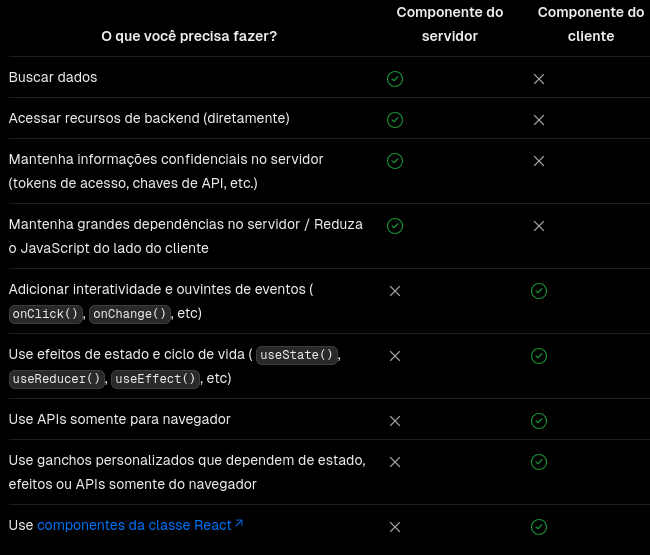

# Anotações do Curso de Next.js 14
Este repositório tem como objetivo fornecer uma documentação prática e detalhada dos conceitos avançados em Next.js 14, incluindo exemplos e anotações das principais funcionalidades. As lições abordam desde o básico até conceitos mais avançados, permitindo uma compreensão completa do sistema de roteamento do Next.js.

## Parte 1: Roteamento

### 1. Definição de Rotas
  - Em Next.js, rotas são criadas automaticamente com base na estrutura de arquivos dentro do diretório `app` (ou `pages` para versões anteriores).
  - Cada arquivo JavaScript ou TypeScript em `app` representa uma rota.

### 2. Páginas e Layouts

- **Páginas:**
  - Cada componente de página no diretório `app` representa uma rota.
  - Exemplo: `app/about/page.js` cria a rota `/about`.

- **Layouts:**
  - Layouts permitem definir uma estrutura comum para várias páginas.
  - Utilizar `app/layout.js` para definir um layout que envolve páginas.
  - Layouts são aplicados em múltiplas páginas e podem incluir cabeçalhos, rodapés, etc.

### 3. Rotas Dinâmicas

- **Criação de Rotas Dinâmicas:**
  - Utilizar colchetes `[param]` para criar rotas dinâmicas.
  - Exemplo: `app/posts/[id]/page.js` cria uma rota dinâmica para `/posts/:id`.

- **Rotas Dinâmicas Aninhadas:**
  - Organizar rotas dinâmicas com subpastas e arquivos.
  - Exemplo: `app/users/[userId]/posts/[postId]/page.js` para uma rota aninhada.

### 4. Grupos de Rotas

- **Grupos de Rotas:**
    - **Usando colchetes**: agrupar rotas usando colchetes em pastas para aplicar uma estrutura de URL. Exemplo: `app/dashboard/[section]/page.js` permite `/dashboard/:section`.
    - **Usando parênteses**: para organizar rotas e layouts em grupos sem afectar a url. Exemplo: `app/(admin)/dashboard/page.js` cria uma rota `/dashboard` dentro do grupo `(admin)`.
    
### 5. Link e Navegação

- **Componente `Link`:**
  - Utilizar o componente `Link` para navegação entre páginas.
  - Exemplo:
    ```jsx
    import Link from 'next/link';

    function Navigation() {
      return (
        <nav>
          <Link href="/about">About</Link>
          <Link href="/contact">Contact</Link>
        </nav>
      );
    }
    ```

- **Navegação Programática:**
  - Usar `router.push` e `router.replace` para navegação programática.
  - Exemplo:
    ```jsx
    import { useRouter } from 'next/router';

    function RedirectButton() {
      const router = useRouter();

      return (
        <button onClick={() => router.push('/home')}>
          Go to Home
        </button>
      );
    }
    ```

### 6. Tratamento de Erros em Rotas

- **Páginas de Erro:**
  - Criar páginas de erro personalizadas para códigos de status como 404 e 500.
  - Exemplo: `app/404/page.js` para uma página 404 personalizada.

- **Tratamento de Erros:**
  - Implementar lógica para lidar com erros específicos dentro de rotas dinâmicas.
  - Exemplo: Exibir mensagens de erro ou páginas de fallback.

### 7. Rotas Paralelas e Interceptações

- **Rotas Paralelas:**
  - Utilizar rotas paralelas para renderizar múltiplos componentes em uma única página.
  - Exemplo: `app/dashboard/page.js` e `app/dashboard/notifications/page.js` para exibir notificações paralelas.

- **Interceptação de Rotas:**
  - Interceptar e manipular rotas antes de serem exibidas.
  - Exemplo: Usar interceptadores para lógica de autenticação ou redirecionamentos.

### 8. Manipuladores de Rotas e Middleware

- **Manipuladores de Rotas:**
  - Definir manipuladores para alterar o comportamento das rotas, como parâmetros de consulta ou autenticação.
  - Exemplo: Manipular os parâmetros da URL para filtrar conteúdo.

- **Middleware:**
  - Utilizar middleware para lógica que deve ser executada em todas ou algumas rotas.
  - Exemplo: `middleware.ts` para autenticação ou validação de requisições.

## Parte 2: Renderização
Por padrão, o Next.js pré-renderiza cada página. Isso significa que o Next.js gera HTML para cada página com antecedência, em vez de ter tudo feito pelo JavaScript do lado do cliente.

- **Renderização no Lado do Servidor (SSR)**: As páginas são geradas no servidor a cada requisição. Isso garante que os dados estejam sempre atualizados.

- **Renderização Estática (SSG)**: As páginas são geradas no momento da construção e são servidas como arquivos estáticos. Ideal para páginas que não mudam frequentemente.

- **Renderização no Lado do Cliente (CSR)**: O conteúdo é carregado e renderizado no cliente. Isso é útil para interações dinâmicas e dados que mudam frequentemente.

### React Server Components
Por padrão, o Next.js usa Server Components. Permitem que você escreva UI que pode ser renderizada e, opcionalmente, armazenada em cache no servidor. No Next.js, o trabalho de renderização é dividido ainda mais por segmentos de rota para habilitar streaming e renderização parcial, e há três estratégias diferentes de renderização de servidor:

- **Renderização estática (padrão)**: as rotas são renderizadas no momento da construção (build) ou em segundo plano após a revalidação dos dados.

- **Renderização dinâmica**: as rotas são renderizadas para cada usuário no momento da solicitação. Funções dinâmicas dependem de informações que só podem ser conhecidas no momento da solicitação, como cookies do usuário, cabeçalhos de solicitações atuais ou parâmetros de pesquisa da URL.

- **Streaming**: permite que você renderize progressivamente a UI do servidor. O trabalho é dividido em pedaços e transmitido para o cliente conforme fica pronto. Isso permite que o usuário veja partes da página imediatamente, antes que todo o conteúdo tenha terminado de renderizar.

### React Client Components
Os Client Components permitem que você escreva uma IU interativa que é pré-renderizada no servidor e pode usar JavaScript do cliente para executar no navegador.

Há algumas vantagens em fazer o trabalho de renderização no cliente, incluindo:
- **Interatividade**: os componentes do cliente podem usar ouvintes de estado, efeitos e eventos, o que significa que eles podem fornecer feedback imediato ao usuário e atualizar a interface do usuário.

- **APIs do navegador**: os componentes do cliente têm acesso às APIs do navegador, como geolocalizaçãoou localStorage.

### Padrões de composição de servidor e cliente
Ao construir aplicativos React, você precisará considerar quais partes do seu aplicativo devem ser renderizadas no servidor ou no cliente.
#### Quando usar componentes de servidor e cliente?


### Pré-renderização parcial
A pré-renderização parcial (PPR) permite combinar componentes estáticos e dinâmicos na mesma rota. Durante a construção, o Next.js pré-renderiza o máximo possível da rota. Se um código dinâmico for detectado, como a leitura da solicitação de entrada, você pode encapsular o componente relevante com um React **Suspense**. O fallback da **Suspense** será então incluído no HTML pré-renderizado.

## Parte 3: Data Fetching (busca de dados)
Data Fetching refere-se ao processo de recuperação de dados de uma fonte externa, como uma API ou um banco de dados, e a disponibilização desses dados para serem usados na renderização das páginas da aplicação. O Next.js 14 fornece várias abordagens para fazer isso de maneira eficiente.

### Buscando dados no servidor com a fetch API
Este componente buscará e exibirá uma lista de posts de blog. A resposta de fetch será automaticamente armazenada em cache.
```tsx 
export default async function Page() {
  let data = await fetch('https://api.vercel.app/blog')
  let posts = await data.json()
  return (
    <ul>
      {posts.map((post) => (
        <li key={post.id}>{post.title}</li>
      ))}
    </ul>
  )
}
```
Se você não estiver usando nenhuma função dinâmica em nenhum outro lugar nesta rota, ela será pré-renderizada durante `next build` uma página estática.

Se você não quiser armazenar em cache a resposta de fetch, você pode fazer o seguinte:
```jsx
let data = await fetch('https://api.vercel.app/blog', { cache: 'no-store' })
```

### Buscando dados no cliente
No entanto, ainda há casos em que a busca de dados do lado do cliente faz sentido. Nesses cenários, você pode chamar manualmente `fetch`um `useEffect` ou recorrer a bibliotecas React populares na comunidade (como `SWR`ou `React Query`) para busca de dados.